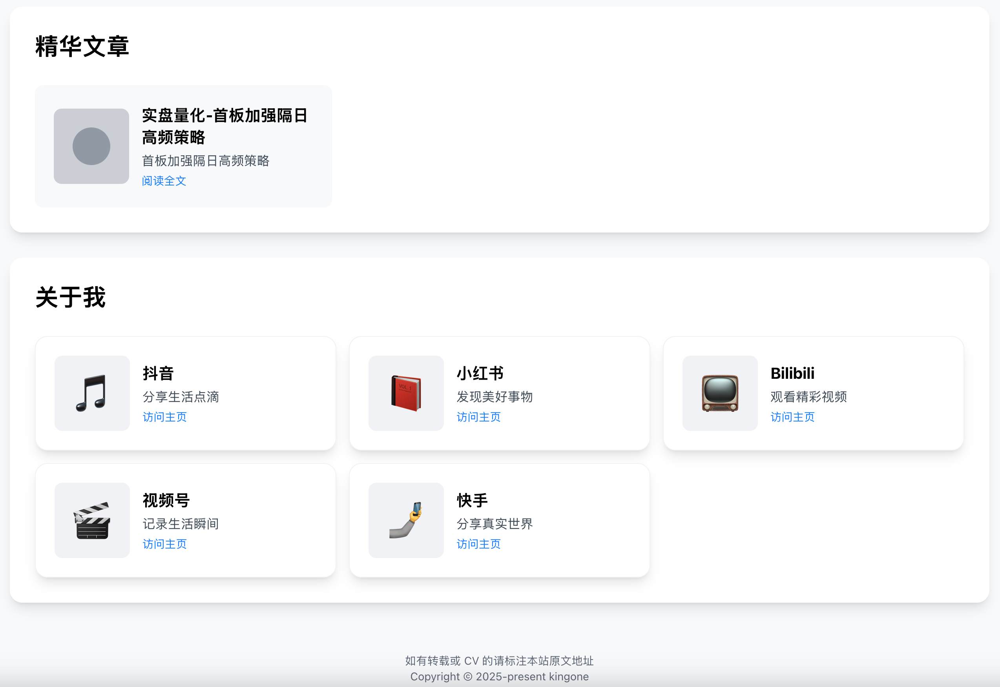
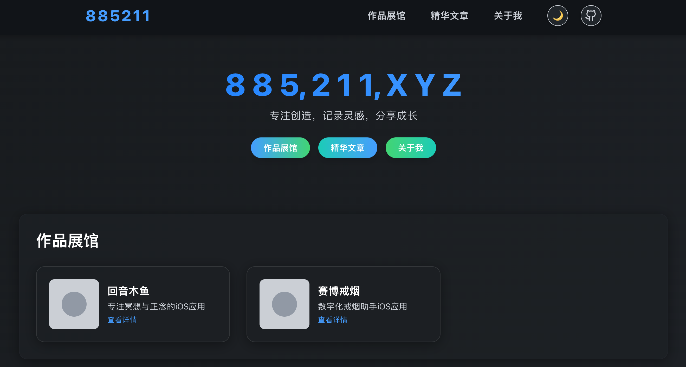

# 885211.XYZ - 个人作品集网站

> 专注创造，记录灵感，分享成长

一个现代化的个人作品集网站，使用 Next.js 14 构建，支持 MDX 文章写作，展示个人项目和技术文章。

非常简单，适合扩展，降低个人网站建设的复杂度。

在这个快节奏的社会很少会静下心来写文章，而本项目专注于只展示自己觉得最值得展示的作品。

## ✨ 特性

- 🎨 **现代化设计** - 简洁优雅的界面设计，支持响应式布局
- 📝 **MDX 支持** - 使用 MDX 编写技术文章，支持代码高亮和自定义组件
- 🚀 **高性能** - 基于 Next.js 14 App Router，优化的构建和部署
- 🎯 **作品展示** - 专业的项目展示页面，突出技术亮点
- 📱 **移动友好** - 完美适配各种设备尺寸
- 🌟 **星空背景** - 动态星空背景效果，提升视觉体验
- 🔗 **社交链接** - 集成多平台社交媒体链接

## 🖼️ 预览

### 网站截图展示






## �‍💻 关于我

> 热爱技术，专注创造有价值的产品

我是一名全栈开发者，对前端技术和用户体验设计充满热情。通过代码创造美好的数字体验，用技术解决实际问题，是我一直追求的目标。

在这个快节奏的时代，我希望通过分享自己的项目和技术文章，与更多志同道合的开发者交流学习，共同成长。每一个项目都承载着我对技术的理解和对用户体验的思考。

## 🛠️ 技术栈

- **框架**: Next.js 15.4.2
- **语言**: TypeScript
- **样式**: Tailwind CSS 4.0
- **内容**: MDX + Gray Matter
- **组件**: Radix UI + Lucide React
- **部署**: Vercel

## 🚀 快速开始

### 环境要求

- Node.js 18.0 或更高版本
- npm、yarn、pnpm 或 bun

### 安装依赖

```bash
# 使用 npm
npm install

# 使用 yarn
yarn install

# 使用 pnpm
pnpm install

# 使用 bun
bun install
```

### 启动开发服务器

```bash
# 使用 npm
npm run dev

# 使用 yarn
yarn dev

# 使用 pnpm
pnpm dev

# 使用 bun
bun dev
```

打开 [http://localhost:3000](http://localhost:3000) 查看网站。

### 构建生产版本

```bash
npm run build
npm run start
```

## 📁 项目结构

```
├── src/
│   ├── app/                 # Next.js App Router 页面
│   │   ├── articles/        # 文章页面
│   │   ├── portfolio/       # 作品集页面
│   │   └── social/          # 社交链接页面
│   ├── components/          # React 组件
│   │   ├── ui/              # UI 基础组件
│   │   ├── ArticleList.tsx  # 文章列表组件
│   │   ├── Header.tsx       # 页面头部
│   │   └── ...
│   └── lib/                 # 工具函数
├── content/                 # MDX 内容文件
│   ├── articles/            # 技术文章
│   └── portfolio/           # 项目展示
├── public/                  # 静态资源
└── ...
```

## ✍️ 内容管理

### 添加文章

在 `content/articles/` 目录下创建新的 `.mdx` 文件：

```mdx
---
title: "文章标题"
description: "文章描述"
date: "2024-01-01"
tags: ["技术", "教程"]
---

# 文章内容

这里是文章正文...
```

### 添加项目

在 `content/portfolio/` 目录下创建新的 `.mdx` 文件：

```mdx
---
title: "项目名称"
description: "项目描述"
tech: ["React", "Next.js"]
link: "https://project-url.com"
github: "https://github.com/username/repo"
---

# 项目详情

项目介绍和技术实现...
```

## 🎨 自定义配置

### 修改个人信息

编辑 `src/components/Header.tsx` 和相关组件文件来更新个人信息。

### 自定义样式

项目使用 Tailwind CSS，可以在 `tailwind.config.ts` 中自定义主题配置。

### 添加新页面

在 `src/app/` 目录下创建新的路由文件夹和页面组件。

## 📦 部署

### Vercel 部署（推荐）

1. 将代码推送到 GitHub
2. 在 [Vercel](https://vercel.com) 中导入项目
3. 自动部署完成

### 其他平台

项目支持部署到任何支持 Node.js 的平台：

- Cloudflare
- Netlify
- Railway
- Render
- 自托管服务器

## 🤝 贡献

欢迎提交 Issue 和 Pull Request！

1. Fork 本项目
2. 创建特性分支 (`git checkout -b feature/AmazingFeature`)
3. 提交更改 (`git commit -m 'Add some AmazingFeature'`)
4. 推送到分支 (`git push origin feature/AmazingFeature`)
5. 开启 Pull Request

## ☕ 支持我的工作

如果这个项目对你有帮助，可以请我喝杯咖啡支持我的开源工作！

[](http://buymeacoffee.com/futurebaidw)

或者通过以下方式支持：

- ⭐ 给项目点个星标
- 🐛 报告 Bug 或提出改进建议  
- 📢 分享给更多需要的人
- 💡 贡献代码或文档

## 📄 许可证

本项目基于 GNU 许可证开源 - 查看 [LICENSE](LICENSE) 文件了解详情。

## 🔗 相关链接

- [Next.js 文档](https://nextjs.org/docs)
- [Tailwind CSS](https://tailwindcss.com)
- [MDX](https://mdxjs.com)
- [Vercel 部署](https://vercel.com)

## 💬 联系方式

如果你有任何问题或建议，欢迎通过以下方式联系：

- 网站: [885211.xyz](https://885211.xyz)
- GitHub: [@kingone](https://github.com/kingone)

---

⭐ 如果这个项目对你有帮助，请给它一个星标！
